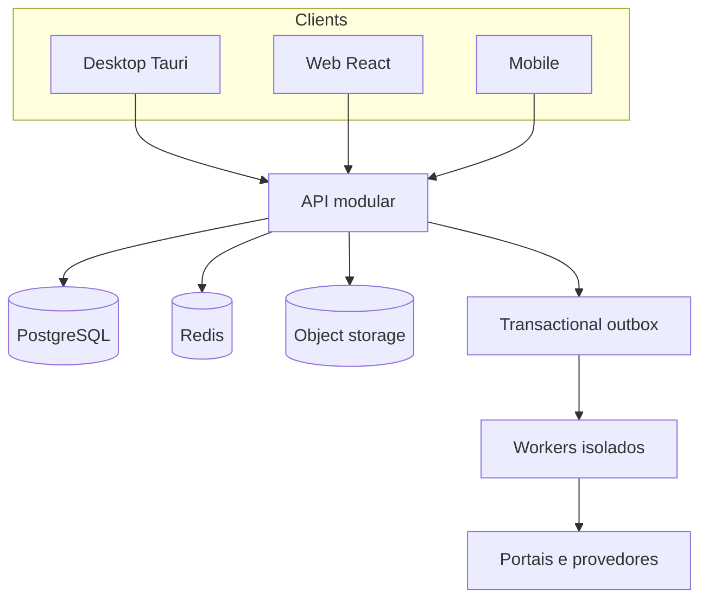

# Arquitetura e decisões v0.1

**Decisão:** monólito modular no servidor, PostgreSQL 16 como fonte de verdade, Redis para fila/cache não autoritativo, armazenamento de objetos para documentos, clientes React pela API; desktop futuro Tauri 2 + SQLite local seletivo. O bootstrap de API neste pacote é propositalmente mínimo e será convertido para módulos NestJS no Sprint 0. Não há dependência do código do InforCFC.

## Fluxo de dados e transações

HTTP → autenticação → organização/unidade/permissão → validação → serviço do domínio → transação SQL → audit event + outbox na **mesma transação** → resposta. Leitores não acessam tabelas alheias para decidir regras. Consumidores de eventos são idempotentes por `eventId`, ignoram duplicados e processam retries com backoff. Outbox é entregue pelo worker somente após commit, com `FOR UPDATE SKIP LOCKED` e registro de falhas; Redis pode acelerar, mas a outbox no Postgres é a fonte de entrega.

## Segurança e isolamento

`organization_id` em entidades operacionais; FKs compostas para evitar ligações entre organizações. Toda consulta da API inclui escopo da organização e unidade autorizada. JWT/OIDC com MFA para papéis sensíveis e vínculo de unidade serão implementados antes de produção. O cabeçalho `X-Organization-Id` apenas seleciona escopo permitido pelo token. Um cabeçalho fornecido pelo cliente nunca concede acesso por si só. Segredos em gestor de secrets, TLS, retenção por finalidade, criptografia de backups, logs sem documento/CPF/token. Criar testes contra acesso cruzado por tenant e unidade; revisar políticas RLS/roles do Postgres antes de staging. A identidade de desenvolvimento atual é explicitamente bloqueada quando `NODE_ENV` não é `development`.

## Observabilidade

JSON logs com `correlationId`, `organizationId` somente quando seguro, `domain`, `operation`, `durationMs`, `outcome`; propagação de trace entre API, outbox e worker. Métricas: p50/p95 de API, filas pendentes e idade da mais antiga, conflito de agenda, sync lag, erros por provedor, tentativas de job, pagamentos conciliados, uso de conexões. Alertar: fila parada, backup sem verificação, falhas externas repetidas, violação anormal de permissões. Não registrar corpos de requisições pessoais.

## Performance e cache

Metas herdadas da especificação: leitura comum p95 ≤ 300 ms, escrita comum p95 ≤ 500 ms (sem externos), pesquisa local ≤ 150 ms. Índices por tenant+unidade e acesso operacional; medir EXPLAIN antes de adicionar cache. Cache de leitura por escopo, versão e TTL curto, invalidado por outbox; nunca confiar em cache para reserva, crédito, autorização ou pagamento. Projeções/materialized views para BI pesado. Desktop sincroniza apenas janela operacional e dados recentes autorizados.

## Entrega e operação

Dev usa Compose; staging e produção devem usar PostgreSQL gerenciado com backup/restauração testados, storage privado e secrets separados. Pipeline: format/typecheck/test → migração em staging → contract/E2E → deploy canário → smoke tests → observação → produção. Toda migration tem plano de roll forward; mudanças incompatíveis seguem expand/migrate/contract. Antes de corte do legado, rodar operação paralela com conciliação de alunos, agenda, créditos e financeiro.

## Convenções

Banco `snake_case`, tabelas singulares, coluna monetária `_cents` bigint, tempo UTC/timestamptz com apresentação `America/Sao_Paulo`, IDs UUID, eventos `domain.fact.v1`, endpoints `/api/v1`, erros `UPPER_SNAKE_CASE`. Controller só orquestra; transação no serviço de aplicação; regra em domínio; adapter externo substituível. Cada mutation sensível carrega `Idempotency-Key` e grava auditoria/outbox.

Referências técnicas oficiais: [PostgreSQL constraints](https://www.postgresql.org/docs/16/ddl-constraints.html), [NestJS modules](https://docs.nestjs.com/modules), [Tauri SQL plugin](https://v2.tauri.app/plugin/sql/). Os detalhes de implantação devem ser confirmados com a versão fixada de cada dependência antes do Sprint 0.
