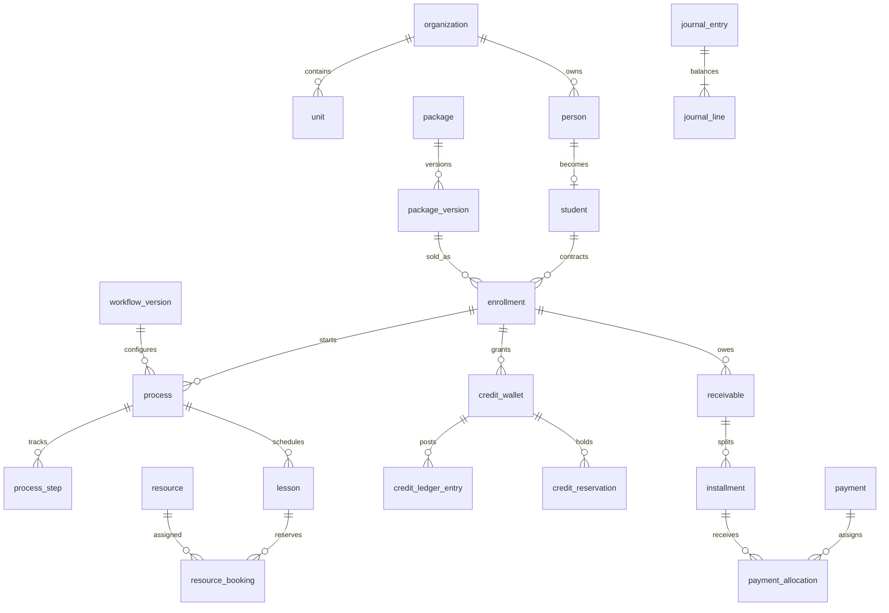

# Modelo de dados e ERD

Migrations em `packages/database/migrations`. A figura mostra os agregados centrais; `erd-full.mmd` traz o inventário gerado de **66 tabelas e 123 ligações de FKs** com colunas; regenere com `python3 scripts/generate_erd.py`. O DDL é a fonte autoritativa para chaves compostas, constraints e índices, inclusive os criados por `ALTER TABLE`.

Todas as entidades operacionais de escrita portam `organization_id`, chaves cruzadas usam `(id,organization_id)` quando modeladas. `lesson_student_no_overlap` e `resource_no_overlap` são constraints GiST parciais sobre `tstzrange [)`, aceitando horários adjacentes. `credit_ledger_entry`, `journal_line`, `journal_entry`, `audit_event`, `process_transition` rejeitam UPDATE/DELETE. Journal exige pelo menos dois lançamentos balanceados no commit; triggers de crédito e alocação serializam escritas sobre wallet/pagamento/parcela. **Limites conhecidos:** disponibilidade/bloqueio, período da reserva igual ao da aula, cumulativos de estorno e autorização ainda dependem do serviço; invariantes exigem testes integrados antes de endpoints de escrita.

Para relatórios: projeções de aluno por etapa, agenda por recurso/dia, aging por unidade, crédito disponível. Não consultar todas as tabelas transacionais a cada tela. `outbox_event` guarda fatos para projeções; `audit_event` descreve quem fez alterações; são finalidades diferentes.
