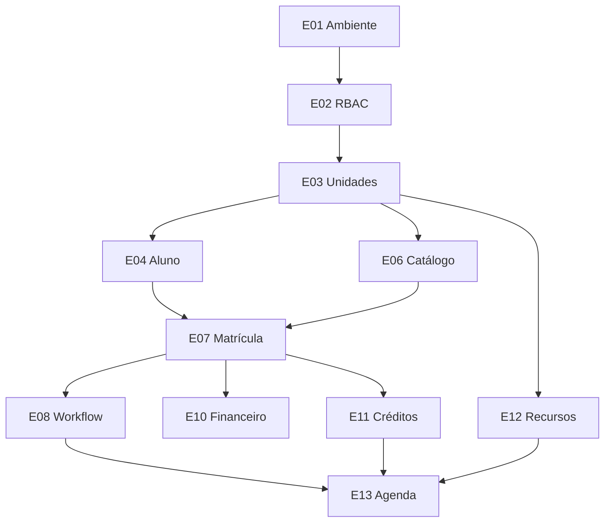

# Backlog inicial — 21 épicos

**Progresso em 26/09/2026:** ST-03/ST-07 foram confirmadas em PostgreSQL; ST-04/ST-05/ST-06 têm implementação e integração sintética no banco `_test`; E09 tem fila por unidade, responsável e prazo. E10/E11/E12/E13 têm fluxo de desenvolvimento para recebível, pagamento/estorno, créditos, recursos e aula com reserva concorrente, cancelamento e consumo, incluindo banco, API, RBAC, auditoria, outbox, contratos, testes e tela. E19 básico calcula alunos por etapa, aulas e financeiro por unidade; um dispatcher opcional assinado entrega eventos da outbox com retry. ST-01/ST-02/ST-08 foram parcialmente verificados no Mac com Compose/Keycloak e o código está no GitHub indicado; CI remoto até a v0.6 passou. Staging, controles operacionais, contrato assinado, regras comerciais/regulatórias reais, documentos, restauração de backup e metas p95 ainda não têm aceite. Os critérios abaixo continuam valendo para encerrar cada história.

Prioridade usa P0 = necessária ao piloto, P1 = após núcleo, P2 = expansão. Dependência indica o que deve estar aceito antes. Cada história tem critérios observáveis; a decomposição abaixo é ponto de partida, não promessa de todos os épicos implementados neste pack.

| Épico | Prioridade | Depende de | História e critério de aceite |
|---|---|---|---|
| E01 Ambiente/CI | P0 | — | Como dev, subo banco/API com um comando; migration repetida não duplica nem perde dados; pipeline roda testes. |
| E02 Identidade/RBAC | P0 | E01 | Como gestor, atribuo papel por unidade; usuário sem membership recebe 403 inclusive por ID direto. |
| E03 Multiunidade | P0 | E02 | Como gestor, vejo consolidado autorizado; secretaria vê apenas suas unidades e FKs não cruzam tenant. |
| E04 Aluno 360 | P0 | E02,E03 | Como secretaria, busco nome/telefone/documento e vejo processos, agenda e pendências em uma tela; trilha tem data/autoria. |
| E05 CRM | P1 | E04 | Como comercial, qualifico lead e registro origem/atividade; conversão mantém vínculo com orçamento. |
| E06 Catálogo/pacotes | P0 | E03 | Como gestor, publico pacote v2 sem alterar matrículas v1; preço e quantidade contratados ficam congelados. |
| E07 Matrícula/contrato | P0 | E04,E06 | Como secretaria, crio matrícula em rascunho e ativo após validação; repetição por chave não duplica processo. |
| E08 Workflow | P0 | E07 | Como secretaria, vejo pré-condições e próximas ações; transição inválida recebe 409 e grava fato/auditoria apenas quando aceita. |
| E09 Tarefas/central | P0 | E08 | Como equipe, filtro vencidas/pendentes por unidade e responsável; evento de etapa cria tarefa uma só vez. |
| E10 Financeiro/ledger | P0 | E07 | Como financeiro, registro recebível e pagamento alocado; débito e crédito balanceiam e estorno é rastreável. |
| E11 Credit Ledger | P0 | E07 | Como secretaria, vejo disponível/held/consumido; duas reservas concorrentes não gastam o mesmo crédito. |
| E12 Instrutores/frota | P0 | E03 | Como coordenador, mantenho disponibilidade, categoria e bloqueio; veículo bloqueado desaparece das sugestões. |
| E13 Agenda prática | P0 | E08,E11,E12 | Como secretaria, reservo aula; competição pelo mesmo aluno/recurso termina com um sucesso e um 409; cancelamento trata hold. |
| E14 Pedagógico | P1 | E13 | Como instrutor, registro presença/avaliação autorizadas; aluno vê evolução sem editar histórico. |
| E15 Teórico/exames | P1 | E08 | Como coordenador, registro turma/resultado e evento desbloqueia próxima etapa quando elegível. |
| E16 Documentos | P0 | E04,E07 | Como secretaria, solicito/aceito versão; download autorizado é temporário e acesso é auditado. |
| E17 Comunicação | P1 | E04,E09 | Como atendimento, envio template com consentimento aplicável e opt-out; status e resposta aparecem na conversa. |
| E18 Automação regulatória | P1 | E08,E09,E16 | Como equipe, enfileiro consulta e vejo retry/erro/evidência; worker não modifica processo diretamente. |
| E19 Relatórios/BI | P0 básico, P1 avançado | E04,E10,E13 | Como gestor, vejo alunos por etapa, aulas e recebíveis por unidade; totais batem com registros de origem. |
| E20 Desktop/sync/apps | P1 | E02,E04,E09 | Como operador, abro alunos recentes offline e rascunhos sincronizam com status claro; revogação apaga cache. |
| E21 Fiscal/IA/integrações | P2 | E10,E16–E20 | Como gestor, acompanho emissão e sugestões assistivas; ação sensível requer confirmação e permissão. |

## Dependências principais

### User stories detalhadas para a primeira fatia

**ST-01 Dev onboarding (E01).** Dado Compose disponível, quando rodo `docker compose up -d`, migrações e seed, então `/health/ready` retorna 200; repetir migrações/seed não duplica. Se DB cair, retorna 503 sem stacktrace.

**ST-02 Identidade por unidade (E02/E03).** Dado usuário com membership na Penha, quando busca aluno da Mooca por lista/ID, não obtém dados; revogação corta acesso na próxima chamada. Organizações diferentes nunca compartilham ID ligado por FK.

**ST-03 Pessoa/Aluno (E04).** Dado documento válido, quando cadastro estudante, então cria Pessoa+Aluno em transação; repetição idempotente retorna mesmo resultado; documento duplicado na mesma organização retorna conflito resolúvel; pessoa sem CPF permitido.

**ST-04 Catálogo versionado (E06).** Dado pacote publicado v1 vendido, quando publico v2 com novo preço, matrícula antiga permanece apontando v1; versão publicada não é alterada retroativamente.

**ST-05 Matrícula (E07).** Dado aluno e pacote acessíveis na unidade, quando ativar, então snapshot de preço, processo na versão correta, outbox e auditoria são persistidos juntos; falha desfaz todos.

**ST-06 Passo do processo (E08).** Dado etapa READY e pré-condição ausente, transição COMPLETED retorna `PREREQUISITE_NOT_MET`; com pré-condição e permissão, altera uma vez e cria tarefa/evento idempotente.

**ST-07 Lista Aluno 360 (E04).** Dado 100 alunos em três unidades, consulta filtra membership, é paginada com cursor estável e não devolve documento integral em lista; histórico aponta fontes.

**ST-08 Teste integração fundação (E01–E04).** Em Postgres real, criação de usuário/organização/unidade/aluno e teste de isolamento cruzado passam no CI; seed não inclui PII real.
